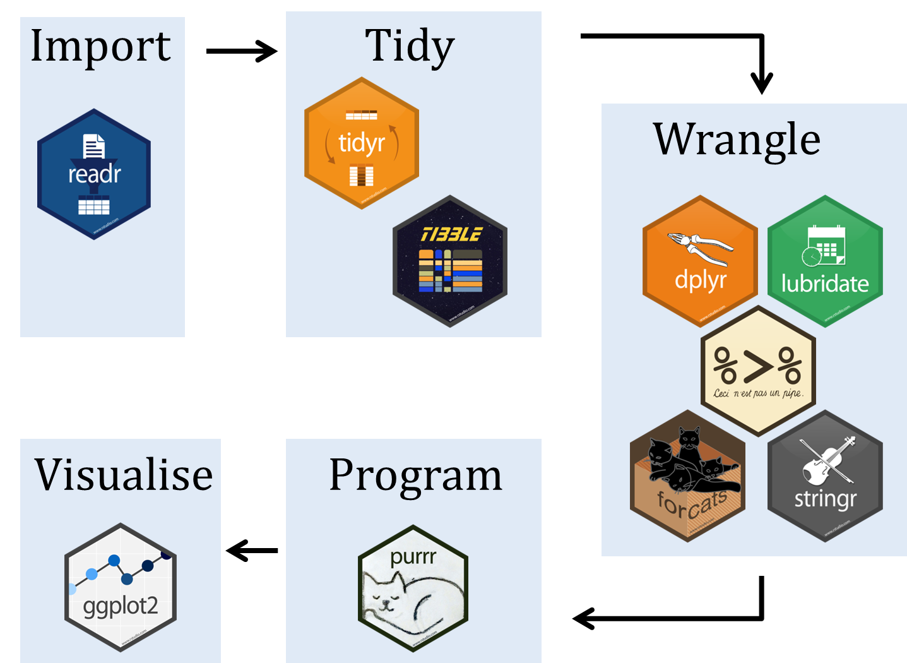

# 7.0 Tidyverse

First, we will start with a fresh, clean environment. 
The code chunk below clears your environment if you want to reset your work in interactive mode. Or use the broom button on the top right corner.

```{r}
rm(list = ls())
```

## Tidyverse
Today we will start using the tidyverse package. Tidyverse is one of the most commonly used R packages and actually contains many packages!

<center>

</center>

<small>Image source: https://ajsmit.github.io/Intro_R_Official/tidy.html</small>


```{r}
library(tidyverse)
library(palmerpenguins)
```

Importing the penguins data from the palmerpenguins package
```{r}
data(package = "palmerpenguins")
```  

```{r}
head(penguins)
```

## Selecting columns

We can extract columns using `select()` like this: `variable <- select(dataframe, column_name)`

Let's select three columns from the `penguins` dataframe using `select()`: `flipper_length_mm`, `body_mass_g`, and `year`.

```{r}


```

Answer: sel_columns <- select(penguins, flipper_length_mm, body_mass_g, year)


To select a range of columns, we can use the colon `:`, just like for vectors. 

Select the columns from `bill_length_mm` to `body_mass_g`.

```{r}


```

Answer: sel_columns2 <- select(penguins, bill_length_mm : body_mass_g)


---


## Helper functions

We can also use helper functions to select multiple columns: 
- starts_with() : starts with a prefix
- ends_with() : ends with a prefix
- contains() : contains a literal string
- matches() : matches a regular expression
- num_range() : a numerical range
- one_of() : variables in character vector
- everything() : all variables


```{r}
# Use the ends_with() function to select columns containing mm
sel_columns3 <- select(penguins, ends_with("mm"))

# Use the contains() function to select columns containing length

sel_columns4 <- select(penguins, contains("length"))


# Use the starts_with() function to select columns containing 
sel_columns_5 <- select(penguins, contains("bill"))

# Can also combine many conditions together using | and & symbols!

sel_columns_lots <- select(penguins, contains("Species") | ends_with("mm"))
```

## Keep rows using `filter()`. 


We can extract rows with the `filter()` function. We can use comparison operators to help us filter rows based on a selection.

Recall the comparision operators are:
    - 


```{r}
# filter rows for only male penguins
male_rows <- filter(penguins, sex == "male")
```


## Combining commands

Keep in mind that there are many ways to accomplish the same goal in R!

Intermediate objects can be very useful if you want to save or keep "intermediate" steps before the final object.
```{r}
# let's try choosing rows with filter using our sel_columns_lots dataframe as an intermediate object

# keep only "Adelie" penguin data
filtered_rows <- filter(sel_columns_lots, species == "Adelie")

# keep only penguins (of all types) with bill_length_mm over 20mm

filtered_rows2 <- filter(sel_columns_lots, bill_length_mm > 20)

# combine two conditions: keep only penguins with flipper length under 185 mm and Chinstrap

filtered_rows3 <- filter(sel_columns_lots, flipper_length_mm < 185 & species == "Chinstrap")
```

We can also combine them together as a nested function:
```{r}
nested_df <- select(filter(penguins, species == "Gentoo"), bill_length_mm, year, sex)
```